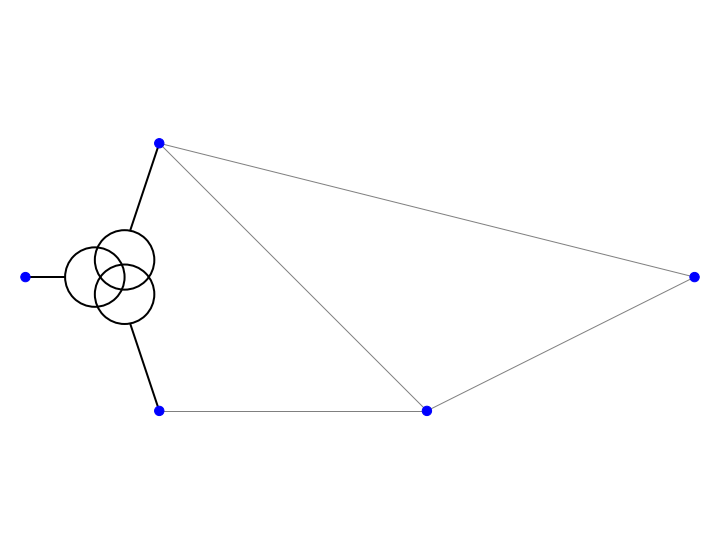

# Run Optimal Power Flow

pandapower now has an interface to PowerModels.jl that can be used for efficient power system optimization.

### What is PowerModels.jl and why should I use it?

- [PowerModels.jl](https://lanl-ansi.github.io/PowerModels.jl/stable/) is  a package for steady-state power network optimization
- It is based on the relatively new language [Julia](https://julialang.org/) which is gaining popularity in scientific applications
- PowerModels uses Julia/JuMP for the optimization, which [clearly outperforms the Python alternative Pyomo](http://yetanothermathprogrammingconsultant.blogspot.com/2015/05/model-generation-in-julia.html)
- PowerModels has a great modular design that allows you to define [different formulations for optimization problems](https://lanl-ansi.github.io/PowerModels.jl/stable/specifications/) based on different [network formulations](https://lanl-ansi.github.io/PowerModels.jl/stable/formulations/) as well as use several [relaxation schemes](https://lanl-ansi.github.io/PowerModels.jl/stable/relaxations/). You can then solve the problem using many open source as well as commercial solvers through [JuMP](http://www.juliaopt.org/JuMP.jl/0.18/installation.html#getting-solvers)

### Well then why do I still need pandapower?

Because pandapower:

- allows you to easily define power systems with nameplate parameters and standard types
- comes with thouroughly validated element models of transformers with tap changers, three-winding transformers, switches/breakers, extended ward equivalents and many more    
- keeps all data in tables (pandas DataFrames), which makes data management and analysis very comfortable
- provides different power system analysis functions, such as a (very fast) power flow, short-circuit calculation, state estimation, graph searches and a plotting library that can be used on the same grid models
- allows you to do all pre- and postprocessing in Python, which still has a much richer environment of free libraries than Julia (currently 157,755 packages on PyPI vs. 1,906 libraries on Pkg)

So using pandapower to define the grid models and then using PowerModels for the optimization really gives you the best of all worlds - you can use the rich environment of Python libraries, the sophisticated element models of pandapower, the modular optimization framework of PowerModels and the efficient mathematical modeling of JuMP.

### Let's get started

So here is an example of how it works. First, we create a grid in pandapower. Here, we create a meshed 110kV grid with four buses that is fed from an 220kV network through a 3-Winding transformer.


```python
import pandapower as pp
import numpy as np
net = pp.create_empty_network()

min_vm_pu = 0.95
max_vm_pu = 1.05

#create buses
bus1 = pp.create_bus(net, vn_kv=220., geodata=(5,9), min_vm_pu=min_vm_pu, max_vm_pu=max_vm_pu)
bus2 = pp.create_bus(net, vn_kv=110., geodata=(6,10), min_vm_pu=min_vm_pu, max_vm_pu=max_vm_pu)
bus3 = pp.create_bus(net, vn_kv=110., geodata=(10,9), min_vm_pu=min_vm_pu, max_vm_pu=max_vm_pu)
bus4 = pp.create_bus(net, vn_kv=110., geodata=(8,8), min_vm_pu=min_vm_pu, max_vm_pu=max_vm_pu)
bus5 = pp.create_bus(net, vn_kv=110., geodata=(6,8), min_vm_pu=min_vm_pu, max_vm_pu=max_vm_pu)

#create 220/110/110 kV 3W-transformer
pp.create_transformer3w_from_parameters(net, bus1, bus2, bus5, vn_hv_kv=220, vn_mv_kv=110,
                                        vn_lv_kv=110, vk_hv_percent=10., vk_mv_percent=10.,
                                        vk_lv_percent=10., vkr_hv_percent=0.5,
                                        vkr_mv_percent=0.5, vkr_lv_percent=0.5, pfe_kw=10,
                                        i0_percent=0.1, shift_mv_degree=0, shift_lv_degree=0,
                                        sn_hv_mva=100, sn_mv_mva=50, sn_lv_mva=50)

#create 110 kV lines
l1 = pp.create_line(net, bus2, bus3, length_km=70., std_type='149-AL1/24-ST1A 110.0')
l2 = pp.create_line(net, bus3, bus4, length_km=50., std_type='149-AL1/24-ST1A 110.0')
l3 = pp.create_line(net, bus4, bus2, length_km=40., std_type='149-AL1/24-ST1A 110.0')
l4 = pp.create_line(net, bus4, bus5, length_km=30., std_type='149-AL1/24-ST1A 110.0')

#create loads
pp.create_load(net, bus2, p_mw=60)
pp.create_load(net, bus3, p_mw=70)
pp.create_load(net, bus4, p_mw=10)

#create generators
g1 = pp.create_gen(net, bus1, p_mw=40, min_p_mw=0, max_p_mw=200, vm_pu=1.01, slack=True)
pp.create_poly_cost(net, g1, 'gen', cp1_eur_per_mw=1)

g2 = pp.create_gen(net, bus3, p_mw=40, min_p_mw=0, max_p_mw=200, vm_pu=1.01)
pp.create_poly_cost(net, g2, 'gen', cp1_eur_per_mw=3)

g3 = pp.create_gen(net, bus4, p_mw=50, min_p_mw=0, max_p_mw=200, vm_pu=1.01)
pp.create_poly_cost(net, g3, 'gen', cp1_eur_per_mw=3)
net
```


  This pandapower network includes the following parameter tables:
       - bus (5 elements)
       - load (3 elements)
       - gen (3 elements)
       - line (4 elements)
       - trafo3w (1 element)
       - poly_cost (3 elements)
       - bus_geodata (5 elements)


Note that PowerModels does not have a 3W-transformer model, but since pandapower includes the equations to calculates the equivalent branches for the 3W-transformers, it is possible to optimize grids with 3W-transformers in PowerModels through the pandapower interface. The same is true for other complex transformer models, switches/breaker, extended ward equivalents etc.

Let's have a look at the grid we created with pandapowers plotting module:


```python
import pandapower.plotting as plot
%matplotlib inline
plot.simple_plot(net)
```




Now lets run an OPF through PowerModels and look at the results (Note that the first time the runpm function is called, Julia is started in the background, which may take some time):


```python
pp.runpm_ac_opf(net)
```

Since Generator 1 has the lowest cost, all required power is supplied through this generator:


```python
net.res_gen
```

| **gen** | **p_mw**      | **q_mvar** | **va_degree** | **vm_pu** |
|:----:|:-------------:|:----------:|:-------------:|:---------:|
| 0    | 1.448510e+02  | 11.037217  | -1.390779e-28 | 1.050000  |
| 1    | -1.000000e-08 | 6.055925   | -1.680643e+01 | 1.013179  |
| 2    | -1.000000e-08 | 13.126070  | -1.298596e+01 | 1.040498  |


This however leeds to an overload in the three-winding transformer, through which g1 is connected:


```python
net.res_trafo3w.loading_percent
```


    0    190.835372
    Name: loading_percent, dtype: float64


Let's set some constraints for the 3W-transformer and the lines and rerun the OPF:


```python
net.trafo3w["max_loading_percent"] = 50
net.line["max_loading_percent"] = 20
pp.runpm_ac_opf(net)
```

The constraints are complied with for all lines and the 3W transformer:


```python
net.res_trafo3w.loading_percent
```


    0    49.974771
    Name: loading_percent, dtype: float64


```python
net.res_line.loading_percent
```


    0    19.047619
    1    12.295419
    2    19.207577
    3     7.088596
    Name: loading_percent, dtype: float64


The power is now generated by a mixture of the generators:


```python
net.res_gen
```
| **gen** | **p_mw**  | **q_mvar** | **va_degree** | **vm_pu** |
|:----:|:---------:|:----------:|:-------------:|:---------:|
| 0    | 24.531626 | -6.267019  | 1.836953e-27  | 1.031058  |
| 1    | 98.101643 | -7.928710  | -3.576364e-01 | 1.050000  |
| 2    | 18.054898 | 9.928333   | -1.446870e+00 | 1.048757  |


In order to use different models, please check [Getting Started](@ref).

### Timings

Comparing the runopp function (that runs an OPF through PYPOWER) and the runpm function shows that PowerModels is much more performant:
```python
%timeit pp.runopp(net)
```

    1.22 s ± 14.9 ms per loop (mean ± std. dev. of 7 runs, 1 loop each)


```python
%timeit pp.runpm_ac_opf(net)
```

    221 ms ± 7.18 ms per loop (mean ± std. dev. of 7 runs, 1 loop each)
